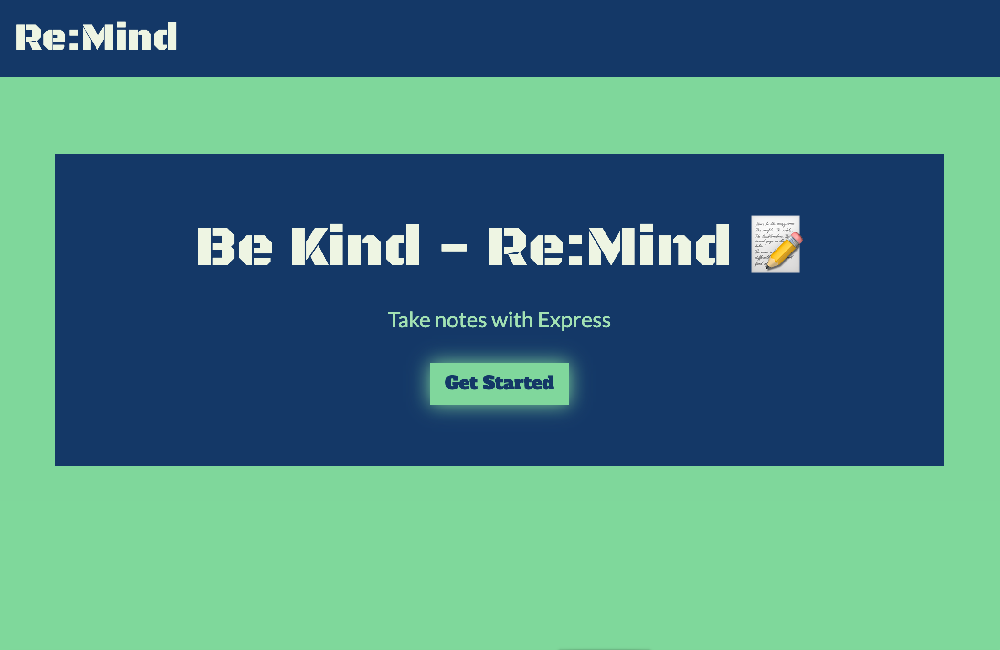
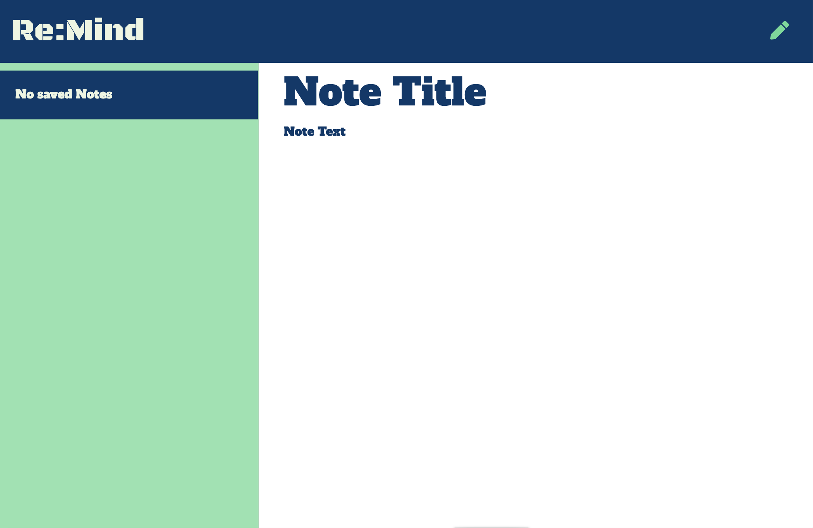
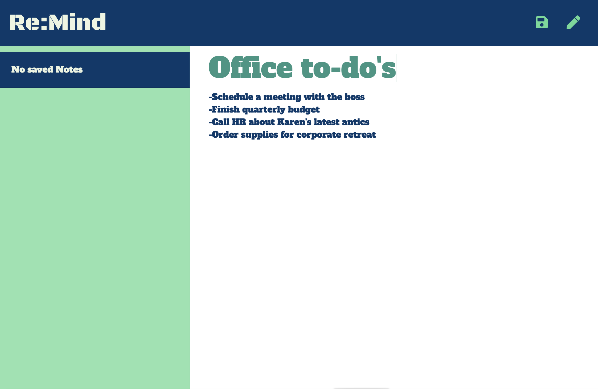
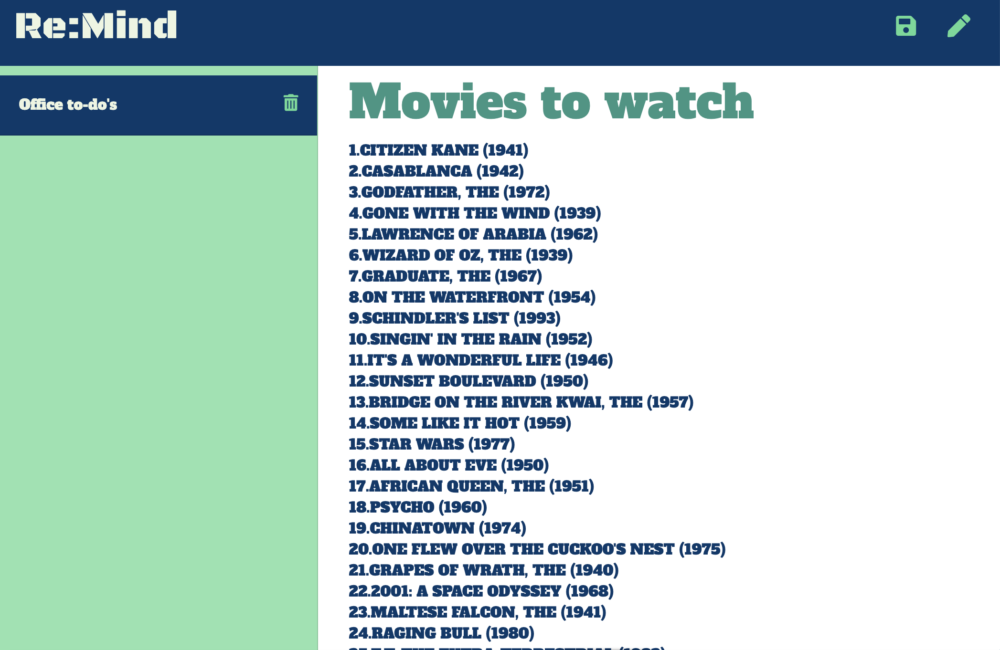
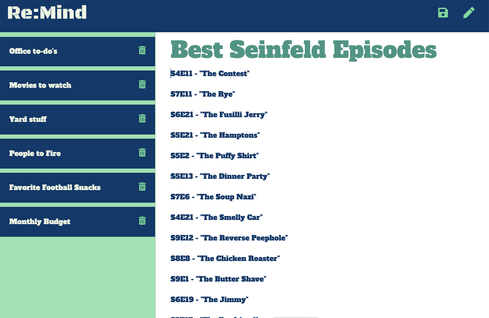

# Re:Mind

Re:Mind is an application that can be used to write, save, and delete notes. This application uses an express backend to save and retrieve note data from a JSON file.

## Table of Contents
* [Installation](#installation)
* [Usage](#usage)
* [License](#license)
* [Contributing](#contributing)
* [Tests](#tests)
* [Questions](#questions)

## Installation
**To run the app on your local server:**
1. Go to https://github.com/dannyfraley/remind and download the zip file to your local network.
2. Unzip the file.
3. Using your terminal command line program, navigate to the unzipped folder called "remind-main".
4. Type the command `npm i` to install the dependencies to your local folder.
5. Type the command `node server.js` to begin using the application. The user prompts will now begin to appear in the terminal.

**To run the app on the deployed heroku site:**
1. Go to https://re-mind.herokuapp.com/

## Usage
1. Click on the "Get Started" button.
2. You can enter text in the "Note Title" and "Note Text" areas. Once you have entered the note, you can click on the `save` disk icon on the top right, or the `new note` icon next to it.
3. Saved notes will update in the left column. You can access them again at any time by clicking on them.
4. To delete the note, you can click on the `delete` trashcan icon on the note.

## License 
This application has been created under the MIT License license.

Copyright (c) 2020 Danny Fraley

Permission is hereby granted, free of charge, to any person obtaining a copy
of this software and associated documentation files (the "Software"), to deal
in the Software without restriction, including without limitation the rights
to use, copy, modify, merge, publish, distribute, sublicense, and/or sell
copies of the Software, and to permit persons to whom the Software is
furnished to do so, subject to the following conditions:

The above copyright notice and this permission notice shall be included in all
copies or substantial portions of the Software.

THE SOFTWARE IS PROVIDED "AS IS", WITHOUT WARRANTY OF ANY KIND, EXPRESS OR
IMPLIED, INCLUDING BUT NOT LIMITED TO THE WARRANTIES OF MERCHANTABILITY,
FITNESS FOR A PARTICULAR PURPOSE AND NONINFRINGEMENT. IN NO EVENT SHALL THE
AUTHORS OR COPYRIGHT HOLDERS BE LIABLE FOR ANY CLAIM, DAMAGES OR OTHER
LIABILITY, WHETHER IN AN ACTION OF CONTRACT, TORT OR OTHERWISE, ARISING FROM,
OUT OF OR IN CONNECTION WITH THE SOFTWARE OR THE USE OR OTHER DEALINGS IN THE
SOFTWARE.

## Contributing
Danny Fraley is currently the sole contributor to this project. If you are interested in contributing, feel free to do so in another branch.

## Tests
Testing performed in VS Code, manually by Danny Fraley.

## Questions
For question about using this application, please contact me at one of the links below.

<a href='https://www.github.com/dannyfraley'>github.com/dannyfraley</a>

<a href='mailto:dannyfraley@gmail.com'>dannyfraley@gmail.com</a>
